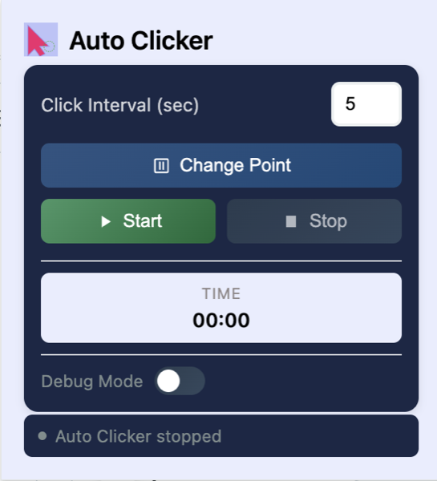

# RhythmKlk - Расширение для Chrome

Легкое и мощное расширение для ритмичных кликов в Chrome с настраиваемыми интервалами и точным таймингом.



## Возможности

- 🎯 Выбор точки клика с визуальным отображением
- ⏱️ Настраиваемые интервалы между кликами
- 🔄 Случайное отклонение интервала для естественности
- 🖼️ Работает в iframe и Flash элементах
- 🎮 Поддержка горячих клавиш
- 🐛 Режим отладки

## Установка

### Способ 1: Прямая установка
1. Скачайте [последний релиз](../../releases/latest/download/rhythmklk.zip)
2. Распакуйте скачанный файл
3. Откройте Chrome и перейдите на `chrome://extensions/`
4. Включите "Режим разработчика" в правом верхнем углу
5. Нажмите "Загрузить распакованное расширение" и выберите распакованную папку

### Способ 2: Установка из исходного кода
1. Клонируйте репозиторий
```bash
git clone https://github.com/YOUR_USERNAME/rhythmklk.git
cd rhythmklk
```
2. Откройте Chrome и перейдите на `chrome://extensions/`
3. Включите "Режим разработчика" в правом верхнем углу
4. Нажмите "Загрузить распакованное расширение" и выберите папку с кодом

## Использование

1. Нажмите на иконку расширения в панели Chrome
2. Нажмите "Выбрать точку" и кликните в нужном месте на странице
3. Установите желаемый интервал между кликами (в секундах)
4. Нажмите "Старт" для начала автокликера
5. Нажмите "Стоп" для остановки

### Горячие клавиши
- `Ctrl+B` (Windows) / `Cmd+B` (Mac): Открыть окно расширения
- `Alt+S`: Включить/выключить автокликер

## Разработка

Расширение создано на чистом JavaScript и следует рекомендациям Chrome's Manifest V3.

### Структура проекта
```
├── manifest.json     # Манифест расширения
├── popup.html       # Интерфейс всплывающего окна
├── popup.js         # Логика всплывающего окна
├── content.js       # Скрипт для выполнения кликов
├── background.js    # Фоновый сервис
└── icons/          # Иконки расширения
```

## Участие в разработке

1. Сделайте форк репозитория
2. Создайте ветку для новой функции (`git checkout -b feature/НоваяФункция`)
3. Зафиксируйте изменения (`git commit -m 'Добавить новую функцию'`)
4. Отправьте изменения в репозиторий (`git push origin feature/НоваяФункция`)
5. Создайте Pull Request

## Лицензия

Распространяется под лицензией MIT. Подробности в файле `LICENSE`.

## Конфиденциальность

Расширение запрашивает следующие разрешения:
- `activeTab`: Для взаимодействия с текущей вкладкой
- `storage`: Для сохранения настроек
- `commands`: Для горячих клавиш
- `scripting`: Для внедрения скриптов

Расширение не собирает и не передает никакие данные за пределы вашего браузера. 